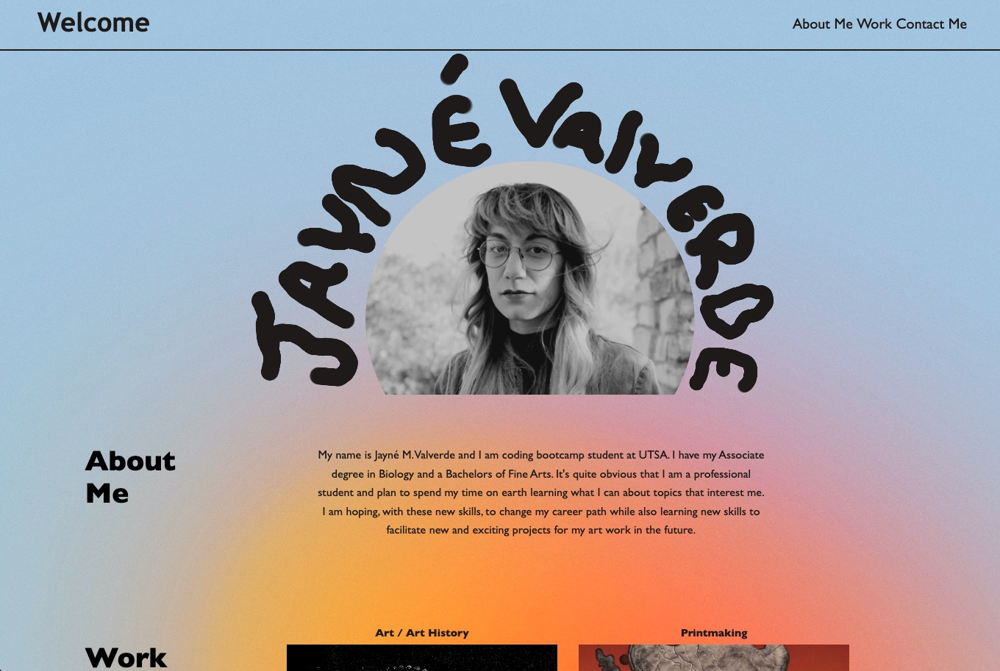

# Jayne's first portfolio 

## [**_Link to deployed website_** ](https://jaynevalverde.github.io/CSS-assignments/)

This weeks challenge was met with a lot of road blocks for me. I finally feel like this site is clean and functional enough to be presented. I was struggeling quite a bit with **Flexbox** arrangment as well as its corrisponding CSS stylings. 

The Webpage is a good start for what I eventually want to be an adequate showcase of my abilities in this field. There are a few things missing from the assignment that I just coudn't make work on my own. For instance, the navigation bar is functional **but** I was not able to make any annimation for the button function. I also have image of my artwork as place holders for future applicaiton links **but** there are still not links attached. 

Despite the pitfalls, this was an enlighting exercise that I was to come back to again soon. Once I was able to see the website come together, I was very excited and inspired to keep exploring! Comming from an artist background, I approched this with the design aspects mind and I cant wait to see what else I can really do once I learn more!

## Screenshot of Website

## Resources 

Through out this challenges went back over a lot of zoom recordings, class assessments and countless google searches. Below are just a few of the main sites and apps I used to help create this site. 

* [Procreate](https://procreate.com/) : for custom hero image
* [W3 Schools](https://www.w3schools.com/) : for basically all tutorials involing css 
* [Codecademy](https://www.codecademy.com/) : for defintions and claificaiton 